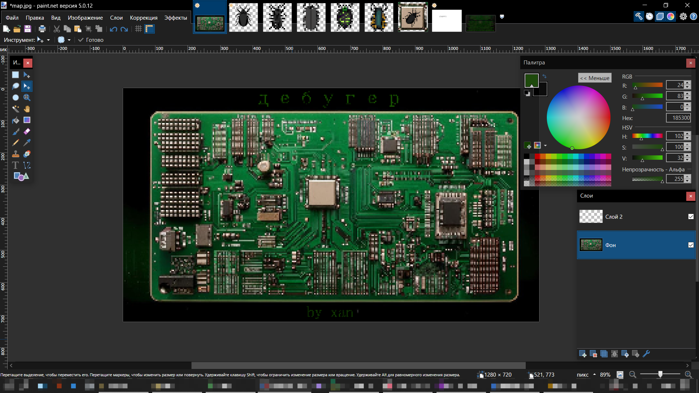
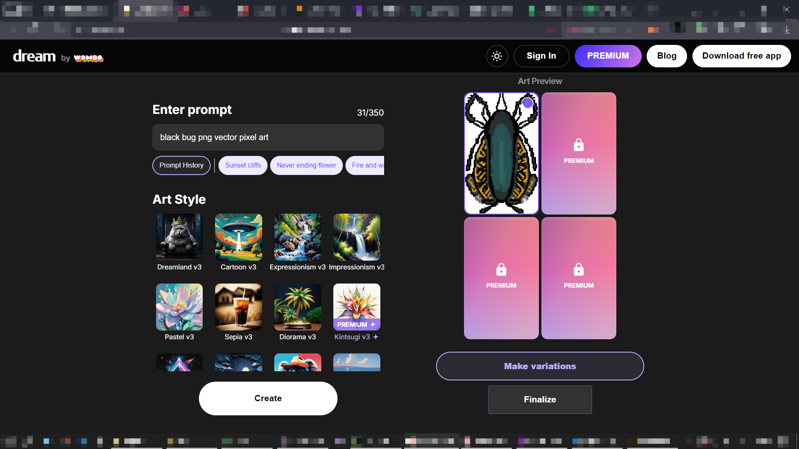
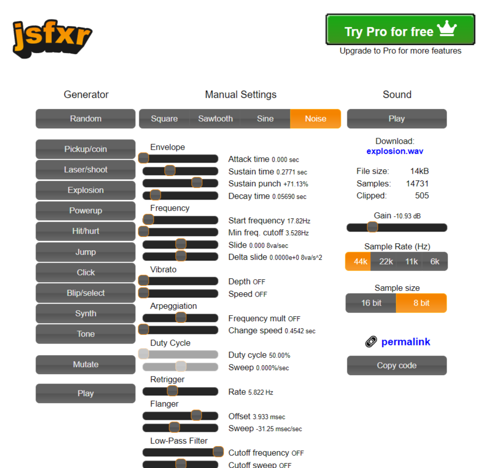
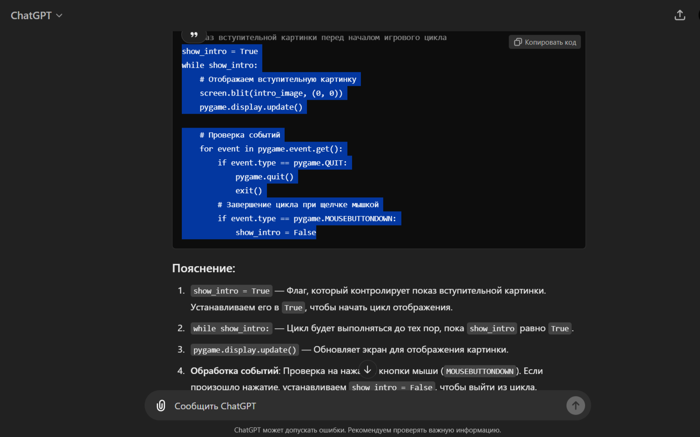
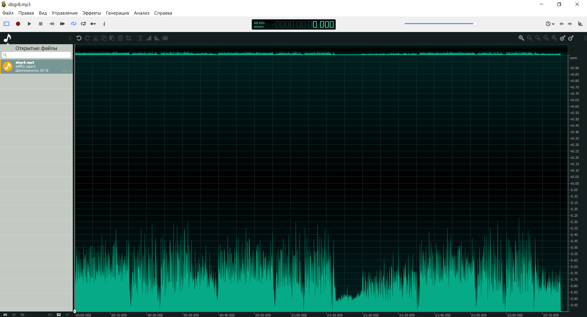

### OG03_xnn
# Игра "Дебугер"
#### Игра "Дебугер" написаноа на языке программирования Python, с использованием библиотеки Pygame.

Игра представляет собой глубокую модификацию игры "Тир", написанной
по материалам урока OG03. 

Игра вдохновлена научным мемом об истории возникновения сленгового выражения "Баг". 

Несколько скриншотов процесса создания игры:

